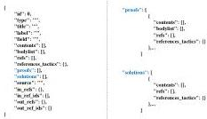

#### 4.2.2 Entity storage

To effectively store key information about mathematical entities, every entity is stored in JSON format, where each key-value pair represents an attribute of the entity. The following entity attributes are selected to store: "id", "type", "label", "title", "field", "contents", "bodylist", "refs", "references_tactics", "source", "proofs", "solutions", "in_refs", "in_ref_ids", "out_refs" and "out_ref_ids". The entity storage structure is depicted in Fig. 4, and detailed information on all attributes can be found in Table B3 of Appendix B.

Specifically, “contents” represents the entity content, presented as a list of sequence strings, with each sequence being a mixture of text and LATEX language. “Bodylist” denotes content segmentation, structured as a nested list of dictionaries, where each dictionary provides a description of the segmented content and its corresponding action label, stored in the keys of “description” and “action”, respectively. “References_tactics” signifies referenced entities and tactic labels, presented as a dictionary, with each key representing a referenced entity and its value indicating the associated tactic label. We assign the same labels to the action and tactic attributes, which are described in Section 4.2.3. Table 2 illustrates examples of content segmentation and reference tactics for Definition, Theorem, and Problem entities. “In_refs” and “out_refs” respectively store information about all incoming and outgoing edge entities of the current entity. Additionally, Theorem entities include “proofs”, and Problem entities include “solutions”. Each theorem proof and problem solution contains “contents”, “bodylist” (only in theorem proofs), “refs” and “references_tactics”, following the same format as above. An instance of a Definition entity is shown in Fig. E1 of Appendix E.

Fig. 4 The schema of entity storage in JSON format.

#### 4.2.3 Entity relation edges

The edges in AutoMathKG are directed edges, representing reference links. An edge from entity vertex  \( v_{i} \in V \)  to entity vertex  \( v_{j} \in V \) , denoted as  \( e_{i \to j} \in E \) , implies that entity  \( v_{j} \)  references entity  \( v_{i} \)  in its content statement, proof process, or solution