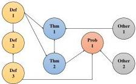

Fig. 5 The diagram of all possible relationships between different types of entities.

### Step 1: Rule-based extraction

For each $\LaTeX$ source code of the input text, rule-based matching method [12], depending on $\LaTeX$ environment names, is conducted to extract basic information of different types of entities. Specifically, it searches for predefined environment names and parses the content contained in these environments into basic information corresponding to the types of entities. For instance, the content surrounded by \begin{theorem} and \end{theorem} in the input text will be parsed as the content of Theorem entities in AutoMathKG. After rule-based matching, most of the following attribute information of entities can be obtained for the current input text: “id”, “type”, “label”, “title”, “contents”, “refs”, “source”, “proofs” and “solutions”.

### Step 2: LLM-based augmentation

After rule-based matching, each entity undergoes content and relationship augmentation by LLM using ICL to complete the remaining attribute information. Specifically, for attributes such as “title”, “field”, “bodylist”, “references_tactics” and “refs”, prompt templates are designed to ask LLM for the information corresponding to each attribute. Considering the different requirements of attribute prompt templates for different entity types, we design a total of 12 prompt templates (see Table C4 in Appendix C for more details). Finally, the fully augmented information of each entity is stored in JSON format, resulting in an Input KG generated from the current input text.

## 5 Method of MathVD construction

Given that similarity searches through graph traversal become increasingly expensive as the scale of the KG expands, we build a VD for AutoMathKG, denoted as MathVD. Through vectorizing the query content and the KG, the similarity between entities is measured through the cosine similarity of their respective vectors, enabling fuzzy search for math knowledge. SBERT [19] is employed to embed the descriptions of math entities, generating 384-dimensional entity vectors. Two strategies for embedding