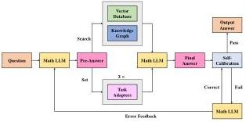

## 6 Method of automatic updates

In this section, we propose two mechanisms for automatically updating our math KG, in order to fully leverage existing mathematical knowledge and maintain synchronization with ongoing advancements in the field. In the first mechanism, a specialized mathematical LLM for solving various math problems is designed, named Math LLM, to achieve automatic knowledge completion by supplementing incomplete proofs or solutions. In the second mechanism, VDs and LLM are utilized to realize automatic knowledge fusion by merging and updating new entities and their relationships from different sources.

### 6.1 Automatic knowledge completion

Given that small-scale LLMs with fewer parameters tend to perform less effectively in mathematical reasoning, this paper proposes Math LLM, specifically designed to address various types of mathematical problems through the integration of task adapters, retrieval augmentation, and self-calibration. Figure 6 illustrates the structure of Math LLM. First, for each mathematical problem input, preliminary information on problem types and knowledge fields is generated. Next, a CoT adapter agent analyzes the information to determine the most appropriate adapter for problem-solving. Meanwhile, relevant knowledge is retrieved from AutoMathKG and MathVD through a two-stage retrieval augmentation. Subsequently, answers are generated using the relevant knowledge as prompts, with the adapter activated. Finally, the self-calibration module reviews and outputs calibrated answers.

Fig. 6 Model architecture of Math LLM.

#### 6.1.1 Task adapters

An adapter is a parameter-efficient fine-tuning strategy that provides plug-and-play functionality, stability, and generalization. It introduces lightweight layers into the model, which are activated only when necessary, allowing the majority of the model