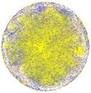

Fig. 7 The visualization of AutoMathKG, with yellow, blue, and red nodes representing Definition, Theorem, and Problem entities.

### 7.3 Evaluation

#### 7.3.1 Reachability query

To assess the capability of the constructed VDs in capturing structural information from the KG, we conducted reachability query experiments to evaluate whether structurally related entities in the KG could be effectively retrieved based on the similarity between the entity embeddings. Specifically, we considered the k-hop reachability query between entities. Two entity nodes A and B are considered k-hop reachable if they can be connected by no more than k directed edges in the graph. For any entity vector e, we retrieved the top q most similar entities using cosine similarity and counted the number of k-hop reachable entities, denoted as r. The hit rate for q queries (Hits@q) is defined as follows:

\[
H i t s @ q = \frac {r}{q}. \tag {4}
\]

We compared MathVD against five baselines, TransE [41], KG2E [42], HoLE [43], R-GCN [44], and BoxE [45], covering different kinds of KG embedding models. We used PyKEEN \( ^{7} \) to implement them, where the vector dimension was set to 384, the same as MathVD. In the experiments, we randomly sampled 100 entities based on the category proportions, including 50 Definition entities, 30 Theorem entities, and 20 Problem entities. Main results of Hits@q for 5-hop reachability query using baselines and our models are shown in Table 7. The best results are highlighted in bold.

The results indicate that for query numbers q = 5, 10, and 15, both MathVD models outperform all baseline models on Hits@q. This suggests that in our constructed VD, most retrieval queries based on cosine similarity are structurally related to the target