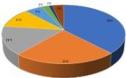
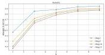
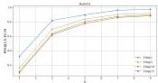

Fig. 8 Mathematical field distribution in AutoMathKG.

Table 7 The results of Hits@q for 5-hop reachability query with q = 1, 5, 10, and 15.

|  Model | Hits@1 | Hits@5 | Hits@10 | Hits@15  |
| --- | --- | --- | --- | --- |
|  TransE | 0.9610 | 0.7766 | 0.7182 | 0.6797  |
|  KG2E | 0.7403 | 0.7325 | 0.7156 | 0.7091  |
|  HoLE | 0.8442 | 0.7688 | 0.7312 | 0.7022  |
|  R-GCN | 0.7273 | 0.7065 | 0.6948 | 0.6840  |
|  BoxE | 0.9351 | 0.8338 | 0.7610 | 0.7247  |
|  MathVD1 | 0.8831 | 0.8364 | 0.8182 | 0.7861  |
|  MathVD2 | 0.8974 | 0.8385 | 0.8013 | 0.7786  |

(a) MathVD1

(b) MathVD2

Fig. 9 The influence of hyperparameter k on Hits@q for MathVD1 and MathVD2.

entities in the KG, showing the effectiveness of our proposed embedding strategies for mathematical entities. Although our VDs are slightly surpassed by the classic TransE model when q = 1, their performance is notably superior at higher q values. This is primarily because TransE is trained by predicting tail entities, which specifically optimizes for 1-hop reachability queries. Consequently, for a single query, TransE achieves a higher hit rate through supervised learning, but exhibits weaker generalization as the query number increases. In contrast, our model generalizes well across varying query numbers. Additionally, comparing our two VDs, it is found that MathVD2 performs slightly better for smaller q, while MathVD1 shows a little higher Hits@q for larger q.