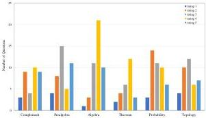

Fig. 10 Rating distribution in test questions.

The evaluation results indicate that Math LLM is capable of demonstrating correct reasoning and providing mostly correct answers in most cases, particularly for challenging problems involving theorem proving. This performance is commendable for a model with 7 billion parameters. Leveraging the various modules we have designed, Math LLM exhibits strong understanding, proof, and computational capabilities, thereby demonstrating its reliability for automatic knowledge completion.

#### 7.3.3 Internal retrieval relevance

To assess the internal quality of our VD, we conducted human evaluations to quantify the precision of relevance in retrieving similar entities across both VDs. For any entity vector e, the top t entities ranked by cosine similarity were retrieved as predictions of t similar entities. If the retrieved entity is related to the target entity in terms of content, domain, or application, it is considered a correct similar prediction. Let s denote the number of correct predictions for entity vector e. The precision p of similar entity retrieval for entity vector e is defined as follows:

\[
p = \frac {s}{t}. \tag {5}
\]

In the experiments, 50 random test samples were drawn from each VD based on the category proportions, including 25 Definition entities, 15 Theorem entities, and 10 Problem entities. These samples are denoted as  \( \{e_{1}^{(1)},\cdots,e_{50}^{(1)}\} \)  for MathVD1, and  \( \{e_{1}^{(2)},\cdots,e_{50}^{(2)}\} \)  for MathVD2 respectively. Similar entity retrieval was performed for each sample, with t=10. After manually evaluating the prediction results, the precision of similar entity retrieval for each sample was calculated, resulting in two series of precision data,

\[
P ^ {(1)} = \left\{p _ {1} ^ {(1)}, \dots , p _ {5 0} ^ {(1)} \right\}, P ^ {(2)} = \left\{p _ {1} ^ {(2)}, \dots , p _ {5 0} ^ {(2)} \right\}. \tag {6}
\]