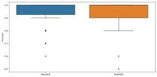

Figure 11 presents box plots of  \( P^{(1)} \)  and  \( P^{(2)} \) , visually illustrating the detailed distribution of two sets of precision data, both of which are concentrated around 1. A Kolmogorov-Smirnov (K-S) test was conducted on  \( P^{(1)} \)  and  \( P^{(2)} \) , indicating no significant difference in the distribution between the two sets of data. Additionally, Table 9 compares the average precision with the standard deviation (STDEV) of similar entity retrieval within MathVD1 and MathVD2. The precision of similar retrieval for all three types of entities exceeds 90%, with MathVD1 exhibiting better performance in the retrieval of Definition and Problem entities, while performing equally well as MathVD2 in Theorem entity retrieval. The average precision of MathVD1 and MathVD2 are both around 95%, with relatively small fluctuations. Therefore, MathVD1 and MathVD2 are both effective in capturing the relationships among internal entities, enabling the retrieval of relevant entities.

Fig. 11 The box plots of MathVD1 and MathVD2.

Table 9 The comparison results of average precision for similar entity retrieval in MathVD1 and MathVD2.

|  Sample type | Def | Thm | Prob | All (STDEV)  |
| --- | --- | --- | --- | --- |
|  MathVD1 | 96.0% | 94.0% | 97.0% | 95.2% (0.0953)  |
|  MathVD2 | 95.3% | 94.0% | 96.0% | 94.8% (0.1035)  |

#### 7.3.4 External retrieval relevance

To assess the external applicability of our VD, we conducted experiments on similar entity retrieval for external queries to evaluate their relevance. First, the queries are embedded into vectors using SBERT, after which similarity retrieval in MathVD is performed, similar to the internal entity retrieval process. Tables 10 and 11 present the retrieved entity contents for the same external query using MathVD1 and MathVD2, respectively. For the query of “Expectation in Probability and Statistics”, both MathVD1 and MathVD2 retrieve definitions and theorems related to “Expectation”, while MathVD1 also retrieves relevant problems, assisting the query requester in understanding this mathematical concept from different perspectives. Therefore, for