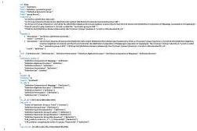

Table C5 The templates of automatic knowledge fusion in Steps 4 and 5.

|  Automatic knowledge fusion | Template  |
| --- | --- |
|  Step 4 | Your task is to decide if the first math theorem mean the same thing as the second theorem. If they have the same meaning, you should answer “yes”. Otherwise, you answer “no”.  |
|  Step 5 | Your task is to decide which of the candidate theorems mean the same thing as the new theorem. You should choose one candidate and output its id number as your answer.  |

## Appendix E More examples for study

Figure E1 presents an instance of a Definition entity stored in JSON format. Table E6 provides another example of similar entity retrieval for the ablation study.

Fig. E1 An instance of a Definition entity in AutoMathKG.

Table E6 The result of another example in ablation study.

|  Theorem: union is associative\( A \cup (B \cup C) = (A \cup B) \cup C \)  |   |   |
| --- | --- | --- |
|  Retrieval results in VD1-no refs  |   |   |
|  Rank | Score | Entity  |
|  1 | 0.7341 | Theorem: intersection is associative  |
|  2 | 0.7317 | Theorem: union is commutative  |
|  3 | 0.7298 | Theorem: union is idempotent  |
|  4 | 0.7090 | Theorem: union distributes over intersection  |
|  5 | 0.7028 | Theorem: cartesian product distributes over union  |
|  Retrieval results in VD1-all  |   |   |
|  Rank | Score | Entity  |
|  1 | 0.8977 | Theorem: union is commutative  |
|  2 | 0.8300 | Theorem: symmetric difference is associative  |
|  3 | 0.8217 | Theorem: set intersection is associative  |
|  4 | 0.7996 | Theorem: union as symmetric difference with intersection  |
|  5 | 0.7808 | Theorem: union with complement  |