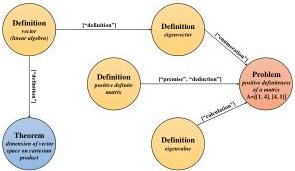

Fig. 1 Examples of entities and reference edges with tactics in AutoMathKG.

As for problem 1, regarding Definition and Theorem entities, we preprocess each collected corpus using the same rule-based matching approach as NaturalProofs dataset, extracting basic information about mathematical definitions, theorems, and theorem proofs, along with extracting reference relationships between them. Regarding Problem entities, since NaturalProofs does not involve math problems, we utilize the problems and their solutions from TheoremQA annotated by GPT-4 in MathInstruct. To associate Problem entities with Definition and Theorem entities, LLM is used to discover potential references to definitions and theorems in Problem entities through ICL. Thus, reference relationships among all kinds of entities are comprehensively extracted. Furthermore, when entities are referenced, we innovatively employ LLM to identify the tactic labels and store them in the directed edges, such as “premise”, “assumption”, “lemma” and so on. These tactic labels for math entities in natural language form clarify how references drive theorem proofs or problem solutions, similar to the use of tactics in the formal language Lean 4 to assist in constructing theorem proofs.

As for problem 2, we store three levels of information for each entity in order to meet the knowledge requirements in different scenarios. Firstly, basic information is obtained directly from the corpus during entity extraction preprocessing, including entity type, label, title, contents, and source. Secondly, advanced information provides step-by-step proofs and derivations, using LLM to divide theorem contents and proofs into logical segments, inspired by Lean 4 while eliminating overly complex strategies and operations. Lastly, query information contains all incoming and outgoing entities related to the current entity. The three levels of information capture the intrinsic logic of mathematical entities in both content statements and reference citations. All entity information is stored in JSON format, where each key-value pair represents an information attribute of the entity. Figure 2 illustrates the flowchart for extracting and storing information from the input corpus to construct the Input KG.

As for problem 3, we design two mechanisms to achieve automatic updates of our math KG. The first mechanism is to supplement the incomplete knowledge of new entities. We build a specialized mathematical LLM called Math LLM, capable of solving various mathematical problems, to complete missing proofs or solutions for