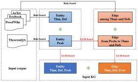
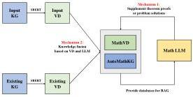

Fig. 2 Model architecture of AutoMathKG construction for building Input KG from input text.

Fig. 3 Model architecture of AutoMathKG automatic updates for knowledge completion by Math LLM and knowledge fusion by VD and LLM between Input KG and Existing KG.

new entities. The second mechanism is to add entities and relationships from new texts in different corpus sources to the Existing KG without duplication or omission. We utilize VD and LLM to update the new entities. First, an Input KG is constructed by extracting entities and relationships from the new input text. Then, Input VD and Existing VD are built from their respective KGs, allowing similar entity candidates for each input entity vector to be retrieved. Finally, through ICL, LLM is employed to determine whether to merge the input entity with a similar candidate or add it as a new entity. Figure 3 depicts the flowchart for the automatic updates of our math KG.

## 4 Method of AutoMathKG construction

### 4.1 Corpus collection

To construct AutoMathKG, we collected diverse data from four sources, including web data from ProofWiki, problem data from TheoremQA, book data from high-quality mathematics textbooks, and paper data from arXiv, covering a wide range