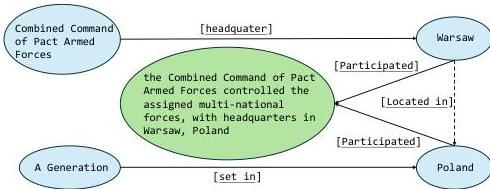
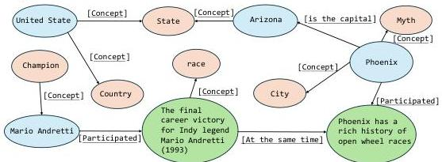

Question: When did the country the top-ranking Warsaw Pact operatives came from, despite it being headquartered in the country where A Generation is set, agree to a unified Germany inside NATO?

Figure 9: Event Node (green) offers enriched context over triplets (blue); dotted line indicates missing edge

Question: Who won the Indy Car Race in the largest populated city of the state where the performer of Mingus Three is from?

Figure 10: Concept nodes (orange) provide alternate pathways to access information beyond entities and events.